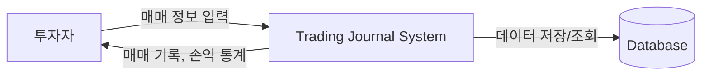
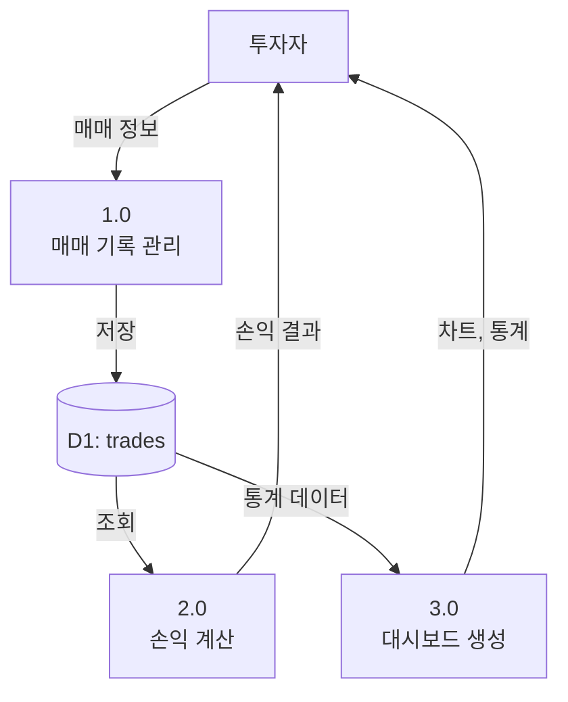

# 1단계: 요구사항 분석 상세

## 📋 문서 개요

| 항목 | 내용 |
|------|------|
| **프로젝트명** | Trading Journal (매매 일지 관리 시스템) |
| **작성일** | 2025-11-23 |
| **작성자** | Database Design Team |
| **문서 버전** | 1.0 |
| **문서 목적** | 데이터베이스 설계를 위한 요구사항 정의 및 분석 |

---

## 1. 프로젝트 배경 및 목적

### 1.1 프로젝트 배경

개인 투자자들은 매매 활동을 체계적으로 기록하고 분석하는 데 어려움을 겪고 있습니다. 시중의 엑셀 템플릿이나 범용 앱들은 다음과 같은 한계를 가지고 있습니다:

- **개인화 부족**: 투자자마다 다른 매매 전략과 분석 요구사항을 충족하지 못함
- **데이터 분산**: 여러 도구에 데이터가 분산되어 통합 분석이 어려움
- **자동화 부재**: 손익 계산, 통계 분석 등을 수동으로 처리해야 함
- **접근성 제한**: 언제 어디서나 접근 가능한 웹 기반 솔루션 부재

### 1.2 프로젝트 목적

Trading Journal 시스템은 다음 목적을 달성하기 위해 개발됩니다:

1. **체계적인 매매 기록 관리**: 모든 매매 활동을 일관된 형식으로 저장
2. **자동화된 손익 분석**: 실시간 손익 계산 및 통계 제공
3. **패턴 인식 지원**: 과거 매매 데이터를 통한 성공/실패 패턴 파악
4. **의사결정 개선**: 데이터 기반의 투자 전략 수립 지원
5. **학습 도구**: 매매 근거 기록을 통한 지속적인 학습

### 1.3 프로젝트 범위

#### 포함 범위 (In-Scope)
- 매매 기록의 생성, 조회, 수정, 삭제 (CRUD)
- 실현 손익(Realized P&L) 자동 계산
- 기본 통계 및 대시보드 제공
- 단일 사용자 환경 (MVP)

#### 제외 범위 (Out-of-Scope - 향후 확장)
- 실시간 시세 연동
- 다중 사용자 및 권한 관리
- 소셜 기능 (매매 공유, 커뮤니티)
- 자동 매매 시스템 연동
- 세금 신고 자동화

---

## 2. 이해관계자 분석

### 2.1 주요 이해관계자

| 이해관계자 | 역할 | 주요 관심사 |
|-----------|------|------------|
| **개인 투자자** | 최종 사용자 | 직관적인 UI, 정확한 손익 계산, 빠른 조회 성능 |
| **시스템 관리자** | 운영자 | 시스템 안정성, 데이터 백업, 모니터링 |
| **개발팀** | 개발/유지보수 | 코드 품질, 확장성, 기술 스택 선택 |
| **데이터베이스 관리자** | DB 설계/운영 | 데이터 무결성, 성능 최적화, 백업/복구 |

### 2.2 사용자 페르소나

**페르소나 1: 초보 투자자 (김초보)**
- **연령**: 28세
- **경력**: 주식 투자 6개월
- **목표**: 매매 습관 개선, 감정적 매매 방지
- **니즈**: 간단한 기록, 손익 추이 확인

**페르소나 2: 중급 투자자 (이중급)**
- **연령**: 35세
- **경력**: 주식 투자 3년
- **목표**: 매매 전략 검증, 승률 개선
- **니즈**: 상세한 통계, 패턴 분석, 매매 근거 기록

---

## 3. 비즈니스 요구사항

### 3.1 핵심 비즈니스 규칙

#### BR-001: 매매 기록 필수 정보
- 모든 매매는 종목코드, 진입가격, 수량, 진입일시를 필수로 기록해야 함
- 매매 근거(reason)는 투자 학습을 위해 필수 입력

#### BR-002: 손익 계산 규칙
- 실현 손익 = (청산가격 × 수량) - (진입가격 × 수량) - 수수료
- 청산되지 않은 포지션(exitPrice = null)은 미실현 상태로 분류
- 수수료는 기본값 0원이며, 사용자가 직접 입력 가능

#### BR-003: 데이터 무결성
- 진입가격과 청산가격은 0보다 커야 함
- 수량은 1 이상의 정수여야 함
- 청산일시는 진입일시보다 이후여야 함 (청산 시)

#### BR-004: 데이터 보존
- 삭제된 매매 기록은 물리적으로 삭제하지 않고 논리적 삭제 (Soft Delete) 적용 고려
- 최소 3년간 데이터 보관 (세법 기준)

### 3.2 비즈니스 프로세스

#### 프로세스 1: 매매 진입 기록

#### 프로세스 2: 매매 청산 및 손익 확정

---

## 4. 기능 요구사항

### 4.1 매매 기록 관리

#### FR-001: 매매 생성 (Create)
- **설명**: 새로운 매매 기록을 시스템에 등록
- **입력**: 종목코드, 진입가격, 수량, 수수료, 매매근거
- **출력**: 생성된 매매 ID, 성공/실패 메시지
- **검증**:
  - 종목코드: 필수, 문자열, 최대 20자
  - 진입가격: 필수, 양수, 소수점 2자리
  - 수량: 필수, 양의 정수
  - 수수료: 선택, 0 이상, 소수점 2자리
  - 매매근거: 필수, 문자열, 최대 500자

#### FR-002: 매매 조회 (Read)
- **설명**: 저장된 매매 기록 조회
- **기능**:
  - 전체 매매 목록 조회
  - 특정 매매 상세 조회 (ID 기반)
  - 기간별 조회 (진입일시 기준)
  - 종목별 조회
- **출력**: 매매 정보 + 계산된 손익 (청산 시)

#### FR-003: 매매 수정 (Update)
- **설명**: 기존 매매 정보 수정
- **수정 가능 항목**:
  - 청산가격, 청산일시 (포지션 청산 시)
  - 수수료 (정정)
  - 매매근거 (추가 분석)
- **제약**: 진입 정보(종목, 진입가격, 수량, 진입일시)는 수정 불가

#### FR-004: 매매 삭제 (Delete)
- **설명**: 잘못 입력된 매매 기록 삭제
- **방식**: 논리적 삭제 (deleted_at 컬럼 활용)
- **권한**: 본인이 생성한 매매만 삭제 가능

### 4.2 손익 계산 및 분석

#### FR-005: 실현 손익 자동 계산
- **설명**: 청산된 매매의 손익을 자동으로 계산
- **계산식**: `(exitPrice × quantity) - (entryPrice × quantity) - fee`
- **표시**: 원화 단위, 소수점 2자리

#### FR-006: 통계 제공
- **총 매매 건수**: 전체 / 진행 중 / 청산 완료
- **총 손익**: 실현 손익 합계
- **승률**: (수익 매매 건수 / 전체 청산 건수) × 100
- **평균 손익**: 총 손익 / 청산 건수

### 4.3 대시보드 및 시각화

#### FR-007: 대시보드 차트
- **손익 추이 차트**: 시간에 따른 누적 손익 그래프
- **종목별 손익**: 종목별 수익/손실 비교
- **월별 통계**: 월별 매매 건수 및 손익

---

## 5. 비기능 요구사항

### 5.1 성능 요구사항

| 요구사항 ID | 설명 | 목표 |
|------------|------|------|
| **NFR-001** | 매매 조회 응답 시간 | 1초 이내 (1,000건 기준) |
| **NFR-002** | 매매 생성 응답 시간 | 500ms 이내 |
| **NFR-003** | 동시 사용자 | 100명 (향후 확장) |
| **NFR-004** | 데이터베이스 용량 | 초기 1GB, 연간 500MB 증가 예상 |

### 5.2 보안 요구사항

| 요구사항 ID | 설명 | 구현 방안 |
|------------|------|----------|
| **NFR-005** | 데이터 암호화 | 민감 정보 암호화 (향후) |
| **NFR-006** | 접근 제어 | 사용자 인증/인가 (향후) |
| **NFR-007** | SQL Injection 방지 | Prepared Statement 사용 |
| **NFR-008** | 감사 로그 | 중요 작업 로깅 (향후) |

### 5.3 가용성 및 신뢰성

| 요구사항 ID | 설명 | 목표 |
|------------|------|------|
| **NFR-009** | 시스템 가용성 | 99.5% (월 3.6시간 다운타임 허용) |
| **NFR-010** | 데이터 백업 | 일 1회 자동 백업 |
| **NFR-011** | 복구 시간 목표 (RTO) | 4시간 이내 |
| **NFR-012** | 복구 시점 목표 (RPO) | 24시간 이내 |

### 5.4 확장성

| 요구사항 ID | 설명 | 구현 방안 |
|------------|------|----------|
| **NFR-013** | 수평 확장 | 데이터베이스 Read Replica 지원 |
| **NFR-014** | 데이터 증가 대응 | 파티셔닝 전략 수립 (연도별) |
| **NFR-015** | 기능 확장성 | 모듈화된 아키텍처 설계 |

### 5.5 유지보수성

| 요구사항 ID | 설명 | 구현 방안 |
|------------|------|----------|
| **NFR-016** | 코드 가독성 | Kotlin 코딩 컨벤션 준수 |
| **NFR-017** | 문서화 | API 문서, ERD, 데이터 사전 유지 |
| **NFR-018** | 모니터링 | 로그 수집 및 분석 체계 |

---

## 6. 데이터 요구사항

### 6.1 핵심 데이터 엔티티

#### 6.1.1 매매 (Trade)
Trading Journal의 핵심 데이터 엔티티로, 모든 매매 활동을 기록합니다.

**필수 속성**:
- 매매 ID (고유 식별자)
- 종목 코드
- 진입 가격
- 수량
- 수수료
- 매매 근거
- 진입 일시

**선택 속성**:
- 청산 가격
- 청산 일시

**계산 속성**:
- 실현 손익 (청산 시)

#### 6.1.2 사용자 (User) - 향후 확장
다중 사용자 지원을 위한 엔티티 (Phase 2)

**필수 속성**:
- 사용자 ID
- 이메일
- 비밀번호 (암호화)
- 가입일시

### 6.2 데이터 볼륨 추정

#### 초기 데이터 볼륨 (1년차)
- **사용자 수**: 1명 (MVP)
- **월평균 매매 건수**: 20건
- **연간 매매 건수**: 240건
- **레코드당 크기**: 약 500 bytes
- **연간 데이터 증가량**: 240 × 500 bytes ≈ 120 KB

#### 확장 시나리오 (3년차)
- **사용자 수**: 1,000명
- **사용자당 연간 매매**: 240건
- **연간 총 매매 건수**: 240,000건
- **연간 데이터 증가량**: 240,000 × 500 bytes ≈ 120 MB

### 6.3 데이터 보관 정책

| 데이터 유형 | 보관 기간 | 보관 위치 | 삭제 정책 |
|-----------|----------|----------|----------|
| **활성 매매 데이터** | 영구 | 운영 DB | 사용자 요청 시 논리 삭제 |
| **삭제된 매매** | 3년 | 운영 DB | 3년 후 물리 삭제 |
| **백업 데이터** | 1년 | 백업 스토리지 | 1년 후 삭제 |
| **로그 데이터** | 6개월 | 로그 서버 | 6개월 후 삭제 |

### 6.4 데이터 품질 요구사항

| 품질 속성 | 설명 | 측정 방법 |
|----------|------|----------|
| **정확성** | 입력된 데이터가 실제 매매 내역과 일치 | 사용자 검증 |
| **완전성** | 필수 항목이 모두 입력됨 | NOT NULL 제약조건 |
| **일관성** | 데이터 간 논리적 모순이 없음 | CHECK 제약조건 |
| **적시성** | 매매 후 즉시 기록 가능 | 응답 시간 측정 |

---

## 7. 제약사항 및 가정사항

### 7.1 제약사항

#### 기술적 제약사항
- **TC-001**: JDK 21 사용 (Spring Boot 3.2.0 요구사항)
- **TC-002**: H2 Database 사용 (개발 환경)
- **TC-003**: MySQL 8.0 이상 (운영 환경, 향후)
- **TC-004**: 단일 서버 배포 (초기)

#### 비즈니스 제약사항
- **BC-001**: 한국 주식 시장만 지원 (초기)
- **BC-002**: 단일 통화(KRW)만 지원
- **BC-003**: 현물 거래만 지원 (선물/옵션 제외)

### 7.2 가정사항

- **AS-001**: 사용자는 매매 정보를 수동으로 입력함
- **AS-002**: 종목 코드는 사용자가 정확히 입력함 (검증 없음, 초기)
- **AS-003**: 수수료는 사용자가 계산하여 입력함
- **AS-004**: 하루 평균 매매 건수는 5건 미만
- **AS-005**: 시스템은 24/7 운영되지 않음 (개발 초기)

---

## 8. 데이터 흐름도 (DFD)

### Level 0: Context Diagram

### Level 1: Main Processes

---

## 9. 우선순위 및 단계별 구현 계획

### Phase 1: MVP (현재)
- ✅ 매매 CRUD 기능
- ✅ 실현 손익 자동 계산
- ✅ 기본 대시보드 (차트)
- ✅ 단일 사용자 환경

### Phase 2: 사용자 관리 (향후)
- ⏳ 회원가입/로그인
- ⏳ 다중 사용자 지원
- ⏳ 사용자별 데이터 격리

### Phase 3: 고급 분석 (향후)
- ⏳ 승률, 손익비 통계
- ⏳ 종목별/전략별 분석
- ⏳ 차트 이미지 업로드

### Phase 4: 외부 연동 (향후)
- ⏳ 증권사 API 연동
- ⏳ 실시간 시세 조회
- ⏳ 자동 매매 기록

---

## 10. 요구사항 추적 매트릭스 (RTM)

| 요구사항 ID | 요구사항 설명 | 우선순위 | 상태 | 관련 엔티티 |
|------------|-------------|---------|------|-----------|
| FR-001 | 매매 생성 | High | ✅ 구현 | Trade |
| FR-002 | 매매 조회 | High | ✅ 구현 | Trade |
| FR-003 | 매매 수정 | High | ✅ 구현 | Trade |
| FR-004 | 매매 삭제 | Medium | ✅ 구현 | Trade |
| FR-005 | 손익 자동 계산 | High | ✅ 구현 | Trade |
| FR-006 | 통계 제공 | Medium | ⏳ 계획 | Trade |
| FR-007 | 대시보드 차트 | Medium | ✅ 구현 | Trade |

---

## 11. 용어 사전 (Glossary)

| 용어 | 영문 | 정의 |
|------|------|------|
| **매매** | Trade | 주식의 매수 또는 매도 거래 |
| **진입** | Entry | 포지션을 시작하는 매수 행위 |
| **청산** | Exit | 포지션을 종료하는 매도 행위 |
| **실현 손익** | Realized P&L | 청산 완료된 매매의 확정 손익 |
| **미실현 손익** | Unrealized P&L | 아직 청산되지 않은 포지션의 평가 손익 |
| **수수료** | Fee | 거래 시 발생하는 비용 (증권사 수수료 등) |
| **종목 코드** | Symbol | 주식을 식별하는 고유 코드 (예: 005930) |
| **수량** | Quantity | 매매한 주식의 수 |
| **승률** | Win Rate | (수익 매매 건수 / 전체 청산 건수) × 100 |

---

## 12. 승인 및 검토

| 역할 | 이름 | 서명 | 날짜 |
|------|------|------|------|
| **작성자** | Database Design Team | - | 2025-11-23 |
| **검토자** | Technical Lead | - | - |
| **승인자** | Project Manager | - | - |

---

## 부록 A: 참고 문서

- Spring Boot 3.2.0 Documentation
- Spring Data JPA Reference
- H2 Database Documentation
- MySQL 8.0 Reference Manual
- 데이터베이스 설계 표준 (ISO/IEC 11179)

---

## 부록 B: 변경 이력

| 버전 | 날짜 | 작성자 | 변경 내용 |
|------|------|--------|----------|
| 1.0 | 2025-11-23 | Database Design Team | 초안 작성 |

---

**문서 끝**
