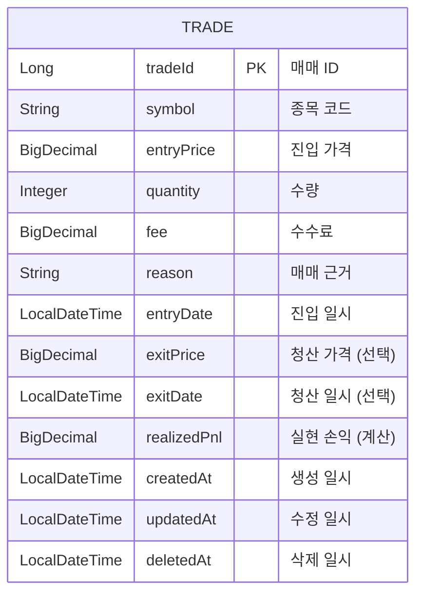
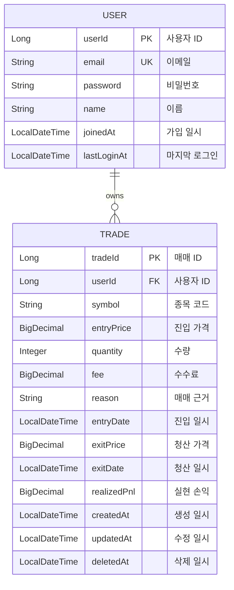
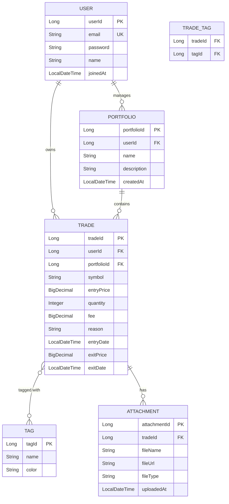
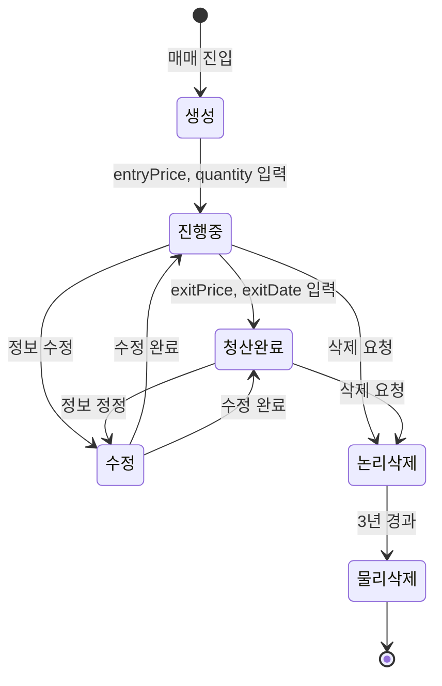

# 2단계: 개념적 데이터 모델링

## 📋 문서 개요

| 항목 | 내용 |
|------|------|
| **프로젝트명** | Trading Journal (매매 일지 관리 시스템) |
| **작성일** | 2025-11-23 |
| **작성자** | Database Design Team |
| **문서 버전** | 1.0 |
| **문서 목적** | 비즈니스 관점의 데이터 구조 정의 (개념적 ERD) |
| **선행 문서** | [1단계_요구사항_분석_상세.md](file:///c:/workdir/space-cap/trading-journal/docs/1단계_요구사항_분석_상세.md) |

---

## 1. 개념적 모델링 개요

### 1.1 개념적 모델링의 목적

개념적 데이터 모델링은 **비즈니스 관점**에서 데이터를 구조화하는 단계입니다. 기술적 세부사항을 배제하고, 조직의 데이터가 무엇이며 어떻게 관련되어 있는지를 명확히 정의합니다.

**주요 목표**:
- 비즈니스 엔티티 식별
- 엔티티 간 관계 정의
- 핵심 속성 파악
- 이해관계자와의 커뮤니케이션 도구

### 1.2 모델링 범위

- **Phase 1 (MVP)**: Trade 엔티티 중심
- **Phase 2 (확장)**: User, Portfolio 엔티티 추가
- **Phase 3 (고급)**: Strategy, Tag, Attachment 엔티티 추가

---

## 2. 엔티티 식별 및 정의

### 2.1 엔티티 식별 프로세스

요구사항 분석 문서에서 **명사**를 추출하여 엔티티 후보를 식별합니다:

| 명사 | 엔티티 여부 | 판단 근거 |
|------|-----------|----------|
| 매매 (Trade) | ✅ 엔티티 | 독립적으로 존재, 고유 식별자 필요 |
| 투자자 (User) | ✅ 엔티티 | 향후 다중 사용자 지원 |
| 종목 (Stock) | ❌ 속성 | Trade의 속성으로 충분 (초기) |
| 손익 (P&L) | ❌ 계산값 | Trade로부터 계산 가능 |
| 수수료 (Fee) | ❌ 속성 | Trade의 속성 |
| 포트폴리오 (Portfolio) | ⏳ 향후 | Phase 2에서 고려 |

### 2.2 핵심 엔티티 정의

#### 엔티티 1: 매매 (Trade)

**정의**: 투자자가 특정 종목에 대해 수행한 매수 및 매도 거래를 기록하는 엔티티

**비즈니스 규칙**:
- 모든 매매는 고유한 식별자를 가짐
- 매매는 진입(Entry)과 청산(Exit) 두 단계로 구성
- 청산되지 않은 매매는 "진행 중" 상태
- 청산된 매매는 실현 손익이 계산됨

**엔티티 특성**:
- **엔티티 타입**: 강한 엔티티 (Strong Entity)
- **존재 의존성**: 독립적으로 존재
- **식별자**: 시스템 생성 ID (Surrogate Key)

#### 엔티티 2: 사용자 (User) - Phase 2

**정의**: 시스템을 사용하는 투자자 계정

**비즈니스 규칙**:
- 사용자는 여러 매매를 소유
- 사용자는 고유한 이메일 주소를 가짐
- 사용자 삭제 시 매매 데이터는 보존 (익명화)

**엔티티 특성**:
- **엔티티 타입**: 강한 엔티티
- **존재 의존성**: 독립적으로 존재
- **식별자**: 시스템 생성 ID

---

## 3. 속성 정의

### 3.1 속성 식별 원칙

- **원자성**: 더 이상 분해할 수 없는 값
- **단일값**: 하나의 값만 저장 (다중값 속성 배제)
- **도메인**: 허용 가능한 값의 범위 정의

### 3.2 Trade 엔티티 속성

#### 3.2.1 식별자 속성

| 속성명 (한글) | 속성명 (영문) | 도메인 | 설명 |
|-------------|-------------|--------|------|
| **매매 ID** | **tradeId** | 정수 (Long) | 시스템 생성 고유 식별자 (PK) |

#### 3.2.2 기본 속성

| 속성명 (한글) | 속성명 (영문) | 도메인 | 필수 | 설명 |
|-------------|-------------|--------|------|------|
| 종목 코드 | symbol | 문자열(20) | ✅ | 거래 종목의 코드 (예: 005930, AAPL) |
| 진입 가격 | entryPrice | 숫자(정밀도) | ✅ | 매수 시 체결 가격 |
| 수량 | quantity | 정수 | ✅ | 매수한 주식 수량 |
| 수수료 | fee | 숫자(정밀도) | ✅ | 거래 수수료 (기본값: 0) |
| 매매 근거 | reason | 문자열(500) | ✅ | 매매를 실행한 이유 |
| 진입 일시 | entryDate | 날짜시간 | ✅ | 매수 체결 일시 |
| 청산 가격 | exitPrice | 숫자(정밀도) | ❌ | 매도 시 체결 가격 |
| 청산 일시 | exitDate | 날짜시간 | ❌ | 매도 체결 일시 |

#### 3.2.3 계산 속성 (Derived Attribute)

| 속성명 (한글) | 속성명 (영문) | 계산식 | 설명 |
|-------------|-------------|--------|------|
| 실현 손익 | realizedPnl | (exitPrice × quantity) - (entryPrice × quantity) - fee | 청산 완료 시 확정 손익 |
| 투자 금액 | investmentAmount | entryPrice × quantity | 총 투자 금액 |
| 수익률 | returnRate | (realizedPnl / investmentAmount) × 100 | 투자 수익률 (%) |

#### 3.2.4 메타데이터 속성

| 속성명 (한글) | 속성명 (영문) | 도메인 | 설명 |
|-------------|-------------|--------|------|
| 생성 일시 | createdAt | 날짜시간 | 레코드 생성 시각 |
| 수정 일시 | updatedAt | 날짜시간 | 레코드 최종 수정 시각 |
| 삭제 일시 | deletedAt | 날짜시간 | 논리 삭제 시각 (Soft Delete) |

### 3.3 User 엔티티 속성 (Phase 2)

| 속성명 (한글) | 속성명 (영문) | 도메인 | 필수 | 설명 |
|-------------|-------------|--------|------|------|
| **사용자 ID** | **userId** | 정수 (Long) | ✅ | 시스템 생성 고유 식별자 (PK) |
| 이메일 | email | 문자열(100) | ✅ | 로그인 ID (Unique) |
| 비밀번호 | password | 문자열(255) | ✅ | 암호화된 비밀번호 |
| 이름 | name | 문자열(50) | ✅ | 사용자 이름 |
| 가입 일시 | joinedAt | 날짜시간 | ✅ | 회원가입 일시 |
| 마지막 로그인 | lastLoginAt | 날짜시간 | ❌ | 최근 로그인 일시 |

---

## 4. 관계 정의

### 4.1 관계 식별 원칙

- **관계명**: 동사 또는 동사구 사용
- **카디널리티**: 1:1, 1:N, N:M 명확히 정의
- **참여도**: 필수(Mandatory) 또는 선택(Optional)

### 4.2 Phase 1: 단일 엔티티 (MVP)

현재 MVP 단계에서는 **Trade 엔티티만 존재**하므로 엔티티 간 관계가 없습니다.

### 4.3 Phase 2: User-Trade 관계

#### 관계 1: User "소유하다" Trade

**관계 정의**:
- **관계명**: 소유하다 (owns)
- **카디널리티**: 1:N (한 사용자는 여러 매매를 소유)
- **참여도**: 
  - User → Trade: 선택 (사용자는 매매가 없을 수 있음)
  - Trade → User: 필수 (모든 매매는 소유자가 있어야 함)

**비즈니스 규칙**:
- 한 사용자는 0개 이상의 매매를 가질 수 있음
- 한 매매는 정확히 1명의 사용자에게 속함
- 사용자 삭제 시 매매는 익명화되거나 보존됨

**관계 표현**:
```
User (1) ----< owns >---- (N) Trade
```

### 4.4 Phase 3: 확장 관계 (향후)

#### 관계 2: Trade "속하다" Portfolio

**관계 정의**:
- **카디널리티**: N:1 (여러 매매가 하나의 포트폴리오에 속함)
- **참여도**: 선택 (매매는 포트폴리오 없이 존재 가능)

#### 관계 3: Trade "태그되다" Tag

**관계 정의**:
- **카디널리티**: N:M (매매는 여러 태그, 태그는 여러 매매)
- **참여도**: 선택
- **연관 엔티티**: TradeTag (중간 테이블)

---

## 5. 개념적 ERD (Entity-Relationship Diagram)

### 5.1 Phase 1: MVP ERD



### 5.2 Phase 2: User 추가 ERD



### 5.3 Phase 3: 전체 확장 ERD (향후)



---

## 6. 엔티티 상세 명세

### 6.1 Trade 엔티티 상세

#### 엔티티 메타데이터

| 항목 | 내용 |
|------|------|
| **엔티티명 (한글)** | 매매 |
| **엔티티명 (영문)** | Trade |
| **엔티티 설명** | 투자자의 주식 매매 거래 기록 |
| **엔티티 타입** | 강한 엔티티 (Strong Entity) |
| **예상 레코드 수** | 연간 240건 (1인 기준) |
| **성장률** | 연 20% |
| **보관 기간** | 영구 (논리 삭제 3년 후 물리 삭제) |

#### 속성 상세 명세

**1. tradeId (매매 ID)**
- **데이터 타입**: Long (64-bit 정수)
- **제약조건**: PRIMARY KEY, NOT NULL, AUTO_INCREMENT
- **도메인**: 1 ~ 9,223,372,036,854,775,807
- **비즈니스 규칙**: 시스템 자동 생성, 사용자 수정 불가
- **예시**: 1, 2, 3, ...

**2. symbol (종목 코드)**
- **데이터 타입**: String (최대 20자)
- **제약조건**: NOT NULL
- **도메인**: 영문 대문자, 숫자 조합
- **비즈니스 규칙**: 
  - 한국 주식: 6자리 숫자 (예: 005930)
  - 미국 주식: 영문 대문자 (예: AAPL, TSLA)
- **예시**: "005930", "AAPL", "MSFT"

**3. entryPrice (진입 가격)**
- **데이터 타입**: BigDecimal (정밀도: 소수점 2자리)
- **제약조건**: NOT NULL, CHECK (entryPrice > 0)
- **도메인**: 0.01 ~ 999,999,999.99
- **비즈니스 규칙**: 실제 체결 가격, 양수만 허용
- **예시**: 150.50, 75000.00

**4. quantity (수량)**
- **데이터 타입**: Integer (32-bit 정수)
- **제약조건**: NOT NULL, CHECK (quantity > 0)
- **도메인**: 1 ~ 2,147,483,647
- **비즈니스 규칙**: 1주 이상, 정수만 허용
- **예시**: 10, 100, 1000

**5. fee (수수료)**
- **데이터 타입**: BigDecimal (정밀도: 소수점 2자리)
- **제약조건**: NOT NULL, CHECK (fee >= 0), DEFAULT 0
- **도메인**: 0.00 ~ 999,999.99
- **비즈니스 규칙**: 거래 수수료, 0 이상
- **예시**: 0.00, 1.50, 100.00

**6. reason (매매 근거)**
- **데이터 타입**: String (최대 500자)
- **제약조건**: NOT NULL
- **도메인**: 자유 텍스트
- **비즈니스 규칙**: 매매 의사결정 근거 기록
- **예시**: "기술적 분석 기반 매수", "뉴스 반등 기대"

**7. entryDate (진입 일시)**
- **데이터 타입**: LocalDateTime
- **제약조건**: NOT NULL, DEFAULT CURRENT_TIMESTAMP
- **도메인**: 유효한 날짜시간
- **비즈니스 규칙**: 매수 체결 시각, 자동 기록
- **예시**: "2024-01-15T10:30:00"

**8. exitPrice (청산 가격)**
- **데이터 타입**: BigDecimal (정밀도: 소수점 2자리)
- **제약조건**: NULL 허용, CHECK (exitPrice > 0 OR exitPrice IS NULL)
- **도메인**: 0.01 ~ 999,999,999.99 또는 NULL
- **비즈니스 규칙**: 매도 체결 가격, 청산 전에는 NULL
- **예시**: 155.00, NULL

**9. exitDate (청산 일시)**
- **데이터 타입**: LocalDateTime
- **제약조건**: NULL 허용, CHECK (exitDate > entryDate OR exitDate IS NULL)
- **도메인**: 유효한 날짜시간 또는 NULL
- **비즈니스 규칙**: 매도 체결 시각, 진입일시 이후여야 함
- **예시**: "2024-01-20T15:45:00", NULL

**10. realizedPnl (실현 손익) - 계산 속성**
- **데이터 타입**: BigDecimal (정밀도: 소수점 2자리)
- **제약조건**: 계산 속성 (저장하지 않음)
- **계산식**: `(exitPrice × quantity) - (entryPrice × quantity) - fee`
- **비즈니스 규칙**: exitPrice가 NULL이면 realizedPnl도 NULL
- **예시**: 48.50, -20.00, NULL

---

## 7. 도메인 정의

### 7.1 도메인 개념

도메인은 속성이 가질 수 있는 **값의 집합**을 정의합니다. 일관성 있는 도메인 정의는 데이터 품질을 보장합니다.

### 7.2 표준 도메인 정의

| 도메인명 | 데이터 타입 | 제약조건 | 설명 | 예시 |
|---------|-----------|---------|------|------|
| **ID** | Long | NOT NULL, AUTO_INCREMENT | 시스템 생성 식별자 | 1, 2, 3 |
| **종목코드** | String(20) | NOT NULL | 주식 종목 코드 | "005930", "AAPL" |
| **금액** | BigDecimal(12,2) | NOT NULL, >= 0 | 금전적 가치 | 150.50, 0.00 |
| **가격** | BigDecimal(12,2) | NOT NULL, > 0 | 주식 가격 | 75000.00 |
| **수량** | Integer | NOT NULL, > 0 | 주식 수량 | 10, 100 |
| **텍스트_짧음** | String(100) | NOT NULL | 짧은 텍스트 | "삼성전자" |
| **텍스트_중간** | String(500) | NOT NULL | 중간 길이 텍스트 | "매매 근거..." |
| **텍스트_긴** | String(2000) | NULL 허용 | 긴 텍스트 | "상세 분석..." |
| **일시** | LocalDateTime | NOT NULL | 날짜와 시간 | "2024-01-15T10:30:00" |
| **이메일** | String(100) | NOT NULL, UNIQUE | 이메일 주소 | "user@example.com" |
| **비밀번호** | String(255) | NOT NULL | 암호화된 비밀번호 | "$2a$10$..." |

---

## 8. 비즈니스 규칙 매트릭스

### 8.1 엔티티 수준 규칙

| 규칙 ID | 엔티티 | 규칙 설명 | 구현 방법 |
|--------|-------|----------|----------|
| **BR-E001** | Trade | 모든 매매는 고유한 ID를 가져야 함 | PRIMARY KEY 제약조건 |
| **BR-E002** | Trade | 진입 정보는 필수, 청산 정보는 선택 | NOT NULL / NULL 허용 |
| **BR-E003** | Trade | 삭제된 매매는 논리적으로 표시 | deletedAt 컬럼 활용 |
| **BR-E004** | User | 이메일은 고유해야 함 | UNIQUE 제약조건 |

### 8.2 속성 수준 규칙

| 규칙 ID | 속성 | 규칙 설명 | 구현 방법 |
|--------|------|----------|----------|
| **BR-A001** | entryPrice | 진입 가격은 0보다 커야 함 | CHECK (entryPrice > 0) |
| **BR-A002** | quantity | 수량은 1 이상의 정수 | CHECK (quantity > 0) |
| **BR-A003** | fee | 수수료는 0 이상 | CHECK (fee >= 0) |
| **BR-A004** | exitDate | 청산일시는 진입일시 이후 | CHECK (exitDate > entryDate) |
| **BR-A005** | symbol | 종목코드는 빈 문자열 불가 | CHECK (LENGTH(symbol) > 0) |

### 8.3 관계 수준 규칙

| 규칙 ID | 관계 | 규칙 설명 | 구현 방법 |
|--------|------|----------|----------|
| **BR-R001** | User-Trade | 매매는 반드시 소유자가 있어야 함 | FOREIGN KEY NOT NULL |
| **BR-R002** | User-Trade | 사용자 삭제 시 매매는 보존 | ON DELETE RESTRICT |

---

## 9. 데이터 생명주기

### 9.1 Trade 엔티티 생명주기



### 9.2 상태별 속성 값

| 상태 | entryPrice | exitPrice | deletedAt | realizedPnl |
|------|-----------|-----------|-----------|-------------|
| **생성** | NOT NULL | NULL | NULL | NULL |
| **진행중** | NOT NULL | NULL | NULL | NULL |
| **청산완료** | NOT NULL | NOT NULL | NULL | 계산됨 |
| **논리삭제** | NOT NULL | NULL/NOT NULL | NOT NULL | NULL/계산됨 |

---

## 10. 개념적 모델 검증

### 10.1 완전성 검증

- ✅ 모든 비즈니스 요구사항이 엔티티/속성으로 표현됨
- ✅ 필수 데이터 항목이 모두 포함됨
- ✅ 계산 가능한 데이터는 계산 속성으로 정의됨

### 10.2 정확성 검증

- ✅ 엔티티명과 속성명이 비즈니스 용어와 일치
- ✅ 관계의 카디널리티가 비즈니스 규칙과 일치
- ✅ 도메인 정의가 실제 데이터 범위를 반영

### 10.3 일관성 검증

- ✅ 명명 규칙이 일관적으로 적용됨
- ✅ 도메인 정의가 재사용됨
- ✅ 비즈니스 규칙이 명확히 문서화됨

---

## 11. 이해관계자 검토 체크리스트

### 11.1 비즈니스 사용자 검토

- [ ] 엔티티명이 이해하기 쉬운가?
- [ ] 속성이 실제 업무 데이터를 충분히 표현하는가?
- [ ] 누락된 데이터 항목은 없는가?
- [ ] 비즈니스 규칙이 정확히 반영되었는가?

### 11.2 기술팀 검토

- [ ] 엔티티 구조가 구현 가능한가?
- [ ] 성능 이슈가 예상되는 부분은 없는가?
- [ ] 확장성이 고려되었는가?
- [ ] 데이터 무결성 제약조건이 명확한가?

---

## 12. 다음 단계 (3단계: 논리적 모델링)

개념적 모델을 기반으로 다음 작업을 수행합니다:

1. **정규화**: 1NF, 2NF, 3NF, BCNF 적용
2. **키 정의**: 기본키, 외래키, 대체키, 인덱스 설계
3. **무결성 제약조건**: 개체, 참조, 도메인 무결성 정의
4. **논리적 ERD**: DBMS 독립적인 논리 스키마 작성

---

## 부록 A: 엔티티-속성 매트릭스

| 엔티티 | 속성 수 | 식별자 | 필수 속성 | 선택 속성 | 계산 속성 |
|-------|--------|--------|----------|----------|----------|
| **Trade** | 13 | tradeId | 7 | 2 | 1 |
| **User** | 6 | userId | 4 | 1 | 0 |

---

## 부록 B: 용어 대조표

| 한글 용어 | 영문 용어 | 약어 | 설명 |
|----------|----------|------|------|
| 매매 | Trade | TRD | 주식 거래 |
| 진입 | Entry | ENT | 매수 행위 |
| 청산 | Exit | EXT | 매도 행위 |
| 실현 손익 | Realized P&L | RPL | 확정 손익 |
| 미실현 손익 | Unrealized P&L | UPL | 평가 손익 |

---

## 부록 C: 변경 이력

| 버전 | 날짜 | 작성자 | 변경 내용 |
|------|------|--------|----------|
| 1.0 | 2025-11-23 | Database Design Team | 초안 작성 |

---

**문서 끝**
