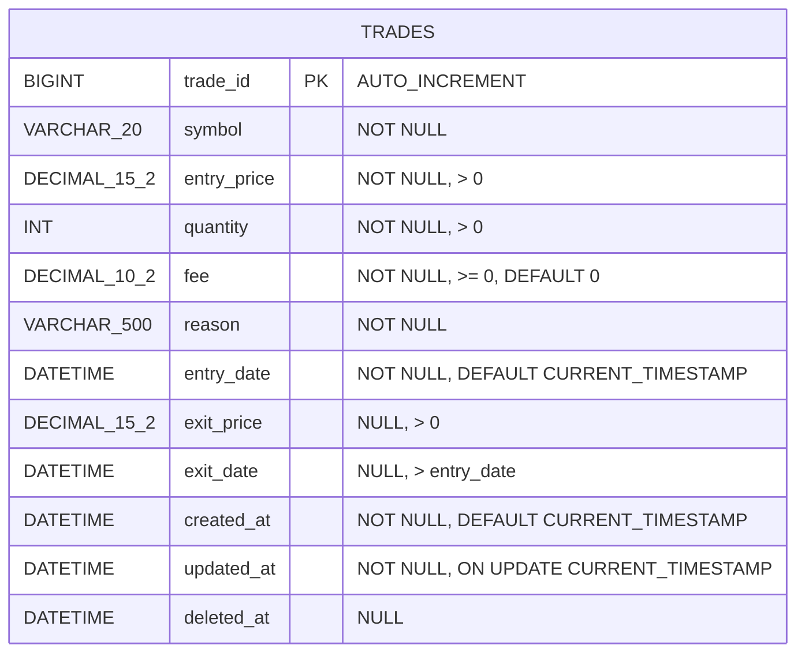
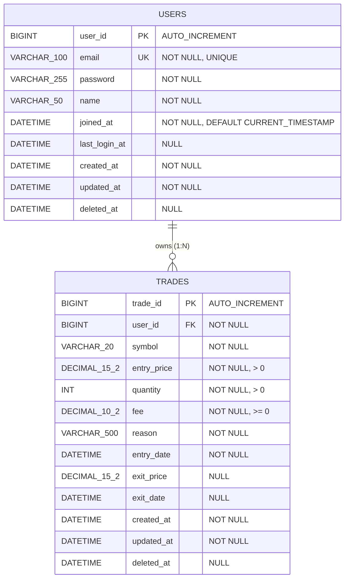
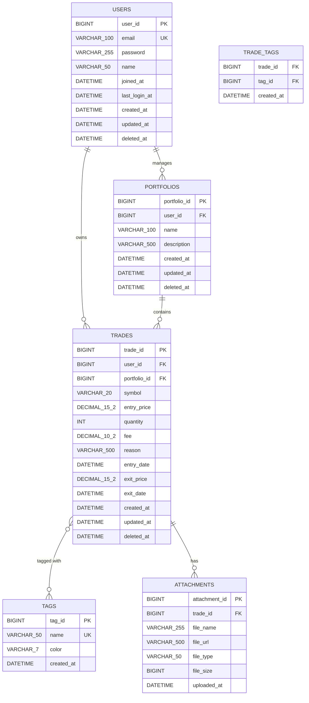

# 3단계: 논리적 데이터 모델링

## 📋 문서 개요

| 항목 | 내용 |
|------|------|
| **프로젝트명** | Trading Journal (매매 일지 관리 시스템) |
| **작성일** | 2025-11-23 |
| **작성자** | Database Design Team |
| **문서 버전** | 1.0 |
| **문서 목적** | DBMS 독립적인 논리적 데이터 구조 설계 |
| **선행 문서** | [2단계_개념적_데이터_모델링.md](file:///c:/workdir/space-cap/trading-journal/docs/2단계_개념적_데이터_모델링.md) |

---

## 1. 논리적 모델링 개요

### 1.1 논리적 모델링의 목적

논리적 데이터 모델링은 개념적 모델을 **관계형 데이터베이스 구조**로 변환하는 단계입니다. DBMS 제품에 독립적이며, 정규화를 통해 데이터 중복을 최소화하고 무결성을 보장합니다.

**주요 목표**:
- 엔티티를 테이블로 변환
- 정규화 적용 (1NF ~ BCNF)
- 키(Key) 정의 (PK, FK, UK, AK)
- 무결성 제약조건 정의
- 인덱스 전략 수립

### 1.2 정규화 전략

Trading Journal 프로젝트는 다음 정규화 수준을 목표로 합니다:

- ✅ **제1정규형 (1NF)**: 원자값, 반복 그룹 제거
- ✅ **제2정규형 (2NF)**: 부분 함수 종속 제거
- ✅ **제3정규형 (3NF)**: 이행 함수 종속 제거
- ✅ **BCNF**: 모든 결정자가 후보키
- ⚠️ **제4정규형 (4NF)**: 다치 종속 제거 (필요 시)
- ⚠️ **제5정규형 (5NF)**: 조인 종속 제거 (필요 시)

> **참고**: 성능을 위해 일부 테이블은 의도적으로 비정규화할 수 있습니다 (4단계에서 결정).

---

## 2. 테이블 설계

### 2.1 테이블 목록

| 테이블명 (영문) | 테이블명 (한글) | 설명 | Phase |
|---------------|---------------|------|-------|
| **trades** | 매매 | 주식 매매 거래 기록 | Phase 1 ✅ |
| **users** | 사용자 | 시스템 사용자 계정 | Phase 2 ⏳ |
| **portfolios** | 포트폴리오 | 매매 그룹화 | Phase 3 ⏳ |
| **tags** | 태그 | 매매 분류 태그 | Phase 3 ⏳ |
| **trade_tags** | 매매-태그 연결 | N:M 관계 해소 | Phase 3 ⏳ |
| **attachments** | 첨부파일 | 차트 이미지 등 | Phase 3 ⏳ |

### 2.2 Phase 1: trades 테이블 상세 설계

#### 2.2.1 테이블 메타데이터

| 항목 | 내용 |
|------|------|
| **테이블명** | trades |
| **테이블 설명** | 투자자의 주식 매매 거래 기록 |
| **기본키** | trade_id |
| **외래키** | 없음 (Phase 1) |
| **예상 레코드 수** | 240건/년 (1인 기준) |
| **성장률** | 연 20% |
| **파티셔닝** | 연도별 Range Partitioning (향후) |

#### 2.2.2 컬럼 정의

| 컬럼명 | 데이터 타입 | NULL | 기본값 | 제약조건 | 설명 |
|-------|-----------|------|--------|---------|------|
| **trade_id** | BIGINT | NOT NULL | AUTO_INCREMENT | PK | 매매 고유 식별자 |
| **symbol** | VARCHAR(20) | NOT NULL | - | CHECK (LENGTH(symbol) > 0) | 종목 코드 |
| **entry_price** | DECIMAL(15,2) | NOT NULL | - | CHECK (entry_price > 0) | 진입 가격 |
| **quantity** | INT | NOT NULL | - | CHECK (quantity > 0) | 수량 |
| **fee** | DECIMAL(10,2) | NOT NULL | 0.00 | CHECK (fee >= 0) | 수수료 |
| **reason** | VARCHAR(500) | NOT NULL | - | CHECK (LENGTH(reason) > 0) | 매매 근거 |
| **entry_date** | DATETIME | NOT NULL | CURRENT_TIMESTAMP | - | 진입 일시 |
| **exit_price** | DECIMAL(15,2) | NULL | NULL | CHECK (exit_price > 0 OR exit_price IS NULL) | 청산 가격 |
| **exit_date** | DATETIME | NULL | NULL | CHECK (exit_date > entry_date OR exit_date IS NULL) | 청산 일시 |
| **created_at** | DATETIME | NOT NULL | CURRENT_TIMESTAMP | - | 레코드 생성 일시 |
| **updated_at** | DATETIME | NOT NULL | CURRENT_TIMESTAMP ON UPDATE | - | 레코드 수정 일시 |
| **deleted_at** | DATETIME | NULL | NULL | - | 논리 삭제 일시 |

#### 2.2.3 정규화 검증

**제1정규형 (1NF) 검증**:
- ✅ 모든 컬럼이 원자값 (Atomic Value)
- ✅ 반복 그룹 없음
- ✅ 각 행이 고유하게 식별됨 (trade_id)

**제2정규형 (2NF) 검증**:
- ✅ 기본키가 단일 컬럼 (trade_id)이므로 부분 함수 종속 불가능
- ✅ 모든 비키 속성이 기본키에 완전 함수 종속

**제3정규형 (3NF) 검증**:
- ✅ 이행 함수 종속 없음
- ✅ 모든 비키 속성이 기본키에만 종속
- ⚠️ `realized_pnl`은 계산 속성이므로 저장하지 않음 (중복 제거)

**BCNF 검증**:
- ✅ 모든 결정자가 후보키 (trade_id만 결정자)

### 2.3 Phase 2: users 테이블 상세 설계

#### 2.3.1 테이블 메타데이터

| 항목 | 내용 |
|------|------|
| **테이블명** | users |
| **테이블 설명** | 시스템 사용자 계정 정보 |
| **기본키** | user_id |
| **외래키** | 없음 |
| **대체키** | email (UNIQUE) |

#### 2.3.2 컬럼 정의

| 컬럼명 | 데이터 타입 | NULL | 기본값 | 제약조건 | 설명 |
|-------|-----------|------|--------|---------|------|
| **user_id** | BIGINT | NOT NULL | AUTO_INCREMENT | PK | 사용자 고유 식별자 |
| **email** | VARCHAR(100) | NOT NULL | - | UNIQUE, CHECK (email LIKE '%@%') | 이메일 (로그인 ID) |
| **password** | VARCHAR(255) | NOT NULL | - | - | 암호화된 비밀번호 |
| **name** | VARCHAR(50) | NOT NULL | - | CHECK (LENGTH(name) > 0) | 사용자 이름 |
| **joined_at** | DATETIME | NOT NULL | CURRENT_TIMESTAMP | - | 가입 일시 |
| **last_login_at** | DATETIME | NULL | NULL | - | 최근 로그인 일시 |
| **created_at** | DATETIME | NOT NULL | CURRENT_TIMESTAMP | - | 레코드 생성 일시 |
| **updated_at** | DATETIME | NOT NULL | CURRENT_TIMESTAMP ON UPDATE | - | 레코드 수정 일시 |
| **deleted_at** | DATETIME | NULL | NULL | - | 논리 삭제 일시 |

---

## 3. 키(Key) 정의

### 3.1 키의 종류

| 키 타입 | 영문 | 설명 | 표기 |
|--------|------|------|------|
| **기본키** | Primary Key | 테이블의 각 행을 고유하게 식별 | PK |
| **외래키** | Foreign Key | 다른 테이블의 기본키 참조 | FK |
| **대체키** | Alternate Key | 기본키 후보였으나 선택되지 않은 키 | AK, UK |
| **후보키** | Candidate Key | 기본키가 될 수 있는 모든 키 | CK |
| **복합키** | Composite Key | 2개 이상의 컬럼으로 구성된 키 | - |

### 3.2 trades 테이블 키 정의

#### 기본키 (Primary Key)
```sql
PRIMARY KEY (trade_id)
```

**선정 근거**:
- 시스템 생성 대리키 (Surrogate Key)
- 불변성 보장 (비즈니스 로직과 무관)
- 단순성 (단일 컬럼)
- 성능 (정수 타입, AUTO_INCREMENT)

**대안 고려**:
- ❌ 자연키 (Natural Key): `(symbol, entry_date)` - 동일 종목 동시 매매 가능성
- ❌ UUID: 성능 저하, 저장 공간 증가

#### 후보키 (Candidate Key)
```sql
UNIQUE (trade_id)  -- 선택된 기본키
-- 다른 후보키 없음 (비즈니스 특성상 중복 매매 허용)
```

#### 인덱스 (Index)
```sql
INDEX idx_trades_symbol (symbol)           -- 종목별 조회
INDEX idx_trades_entry_date (entry_date)   -- 기간별 조회
INDEX idx_trades_deleted_at (deleted_at)   -- 논리 삭제 필터링
INDEX idx_trades_composite (symbol, entry_date)  -- 복합 조회
```

### 3.3 users 테이블 키 정의

#### 기본키 (Primary Key)
```sql
PRIMARY KEY (user_id)
```

#### 대체키 (Alternate Key)
```sql
UNIQUE KEY uk_users_email (email)
```

**선정 근거**:
- 이메일은 사용자 식별에 사용되지만 변경 가능성 있음
- 기본키는 불변 대리키 사용
- 이메일은 UNIQUE 제약조건으로 중복 방지

#### 인덱스 (Index)
```sql
INDEX idx_users_email (email)  -- 로그인 조회 (UNIQUE 제약조건으로 자동 생성)
```

### 3.4 Phase 2: trades 테이블 외래키 추가

#### 외래키 (Foreign Key)
```sql
FOREIGN KEY fk_trades_user (user_id) 
    REFERENCES users(user_id)
    ON DELETE RESTRICT
    ON UPDATE CASCADE
```

**참조 무결성 규칙**:
- **ON DELETE RESTRICT**: 사용자 삭제 시 매매가 있으면 삭제 불가
- **ON UPDATE CASCADE**: 사용자 ID 변경 시 매매의 user_id도 자동 변경 (실제로는 발생하지 않음)

---

## 4. 함수 종속성 분석

### 4.1 함수 종속성 다이어그램 (trades 테이블)

```
trade_id → symbol
trade_id → entry_price
trade_id → quantity
trade_id → fee
trade_id → reason
trade_id → entry_date
trade_id → exit_price
trade_id → exit_date
trade_id → created_at
trade_id → updated_at
trade_id → deleted_at

계산 종속성:
(exit_price, entry_price, quantity, fee) → realized_pnl
```

### 4.2 정규화 단계별 분석

#### 비정규형 → 제1정규형 (1NF)

**문제점 (가상 시나리오)**:
만약 하나의 매매에 여러 종목을 저장한다면?
```
trade_id | symbols        | prices
1        | AAPL, TSLA     | 150.00, 200.00
```

**해결책**:
각 종목을 별도 행으로 분리
```
trade_id | symbol | price
1        | AAPL   | 150.00
2        | TSLA   | 200.00
```

**현재 상태**: ✅ 이미 1NF 충족 (원자값만 저장)

#### 제1정규형 → 제2정규형 (2NF)

**문제점 검토**:
기본키가 단일 컬럼 (trade_id)이므로 부분 함수 종속 불가능

**현재 상태**: ✅ 이미 2NF 충족

#### 제2정규형 → 제3정규형 (3NF)

**문제점 검토**:
이행 함수 종속이 있는가?

예시: `trade_id → symbol → company_name`
- 만약 `company_name` 컬럼이 있다면 이행 종속 발생
- 해결: `stocks` 테이블 분리 (Phase 3에서 고려)

**현재 상태**: ✅ 이미 3NF 충족 (company_name 미저장)

#### 제3정규형 → BCNF

**문제점 검토**:
모든 결정자가 후보키인가?

**현재 상태**: ✅ BCNF 충족 (trade_id만 결정자)

---

## 5. 무결성 제약조건

### 5.1 무결성 제약조건의 종류

| 무결성 타입 | 설명 | 구현 방법 |
|-----------|------|----------|
| **개체 무결성** | 기본키는 NULL 불가, 고유해야 함 | PRIMARY KEY |
| **참조 무결성** | 외래키는 참조 테이블에 존재해야 함 | FOREIGN KEY |
| **도메인 무결성** | 컬럼 값이 정의된 도메인 내에 있어야 함 | CHECK, NOT NULL |
| **사용자 정의 무결성** | 비즈니스 규칙 기반 제약 | CHECK, TRIGGER |

### 5.2 trades 테이블 무결성 제약조건

#### 5.2.1 개체 무결성 (Entity Integrity)

```sql
-- 기본키 제약조건
CONSTRAINT pk_trades PRIMARY KEY (trade_id)

-- 기본키는 자동으로 NOT NULL, UNIQUE 보장
```

#### 5.2.2 도메인 무결성 (Domain Integrity)

```sql
-- NOT NULL 제약조건
trade_id BIGINT NOT NULL
symbol VARCHAR(20) NOT NULL
entry_price DECIMAL(15,2) NOT NULL
quantity INT NOT NULL
fee DECIMAL(10,2) NOT NULL
reason VARCHAR(500) NOT NULL
entry_date DATETIME NOT NULL

-- CHECK 제약조건
CONSTRAINT chk_trades_entry_price CHECK (entry_price > 0)
CONSTRAINT chk_trades_quantity CHECK (quantity > 0)
CONSTRAINT chk_trades_fee CHECK (fee >= 0)
CONSTRAINT chk_trades_exit_price CHECK (exit_price > 0 OR exit_price IS NULL)
CONSTRAINT chk_trades_exit_date CHECK (exit_date > entry_date OR exit_date IS NULL)
CONSTRAINT chk_trades_symbol CHECK (LENGTH(symbol) > 0)
CONSTRAINT chk_trades_reason CHECK (LENGTH(reason) > 0)
```

#### 5.2.3 사용자 정의 무결성 (User-Defined Integrity)

```sql
-- 비즈니스 규칙: 청산 가격과 청산 일시는 함께 존재하거나 함께 NULL
CONSTRAINT chk_trades_exit_consistency 
    CHECK (
        (exit_price IS NULL AND exit_date IS NULL) OR
        (exit_price IS NOT NULL AND exit_date IS NOT NULL)
    )

-- 비즈니스 규칙: 삭제된 레코드는 수정 불가 (애플리케이션 레벨에서 처리)
```

### 5.3 users 테이블 무결성 제약조건

#### 5.3.1 개체 무결성

```sql
CONSTRAINT pk_users PRIMARY KEY (user_id)
```

#### 5.3.2 도메인 무결성

```sql
-- NOT NULL 제약조건
user_id BIGINT NOT NULL
email VARCHAR(100) NOT NULL
password VARCHAR(255) NOT NULL
name VARCHAR(50) NOT NULL
joined_at DATETIME NOT NULL

-- CHECK 제약조건
CONSTRAINT chk_users_email CHECK (email LIKE '%@%')
CONSTRAINT chk_users_name CHECK (LENGTH(name) > 0)
```

#### 5.3.3 대체키 무결성

```sql
CONSTRAINT uk_users_email UNIQUE (email)
```

### 5.4 Phase 2: 참조 무결성 (Referential Integrity)

```sql
-- trades 테이블에 user_id 외래키 추가
ALTER TABLE trades ADD COLUMN user_id BIGINT NOT NULL;

CONSTRAINT fk_trades_user 
    FOREIGN KEY (user_id) 
    REFERENCES users(user_id)
    ON DELETE RESTRICT
    ON UPDATE CASCADE
```

**참조 무결성 규칙**:
- **ON DELETE RESTRICT**: 사용자에게 매매가 있으면 삭제 불가
- **ON UPDATE CASCADE**: 사용자 ID 변경 시 매매도 자동 업데이트
- **ON DELETE SET NULL**: 사용 안 함 (매매는 항상 소유자 필요)
- **ON DELETE CASCADE**: 사용 안 함 (데이터 보존 정책)

---

## 6. 인덱스 전략

### 6.1 인덱스 설계 원칙

1. **선택도 (Selectivity)**: 고유값이 많은 컬럼 우선
2. **카디널리티 (Cardinality)**: 중복이 적은 컬럼 우선
3. **조회 패턴**: 자주 조회되는 컬럼에 인덱스
4. **조인 컬럼**: 외래키에 인덱스
5. **정렬/그룹화**: ORDER BY, GROUP BY 컬럼에 인덱스

### 6.2 trades 테이블 인덱스 설계

#### 6.2.1 기본키 인덱스 (자동 생성)

```sql
-- 클러스터드 인덱스 (InnoDB 기준)
PRIMARY KEY (trade_id)
```

#### 6.2.2 단일 컬럼 인덱스

```sql
-- 종목별 조회 (SELECT * FROM trades WHERE symbol = 'AAPL')
CREATE INDEX idx_trades_symbol ON trades(symbol);

-- 기간별 조회 (SELECT * FROM trades WHERE entry_date BETWEEN ... AND ...)
CREATE INDEX idx_trades_entry_date ON trades(entry_date);

-- 논리 삭제 필터링 (SELECT * FROM trades WHERE deleted_at IS NULL)
CREATE INDEX idx_trades_deleted_at ON trades(deleted_at);
```

#### 6.2.3 복합 인덱스 (Composite Index)

```sql
-- 종목 + 기간 조회 (가장 빈번한 쿼리)
CREATE INDEX idx_trades_symbol_entry_date ON trades(symbol, entry_date);

-- 청산 여부 + 진입일 조회
CREATE INDEX idx_trades_exit_entry ON trades(exit_price, entry_date);
```

**복합 인덱스 순서 결정**:
- 선택도가 높은 컬럼 우선 (symbol)
- 범위 검색 컬럼은 뒤에 배치 (entry_date)

#### 6.2.4 커버링 인덱스 (Covering Index)

```sql
-- 손익 계산 쿼리 최적화
CREATE INDEX idx_trades_pnl_calc 
    ON trades(trade_id, entry_price, exit_price, quantity, fee)
    WHERE exit_price IS NOT NULL;
```

### 6.3 users 테이블 인덱스 설계

```sql
-- 기본키 인덱스 (자동 생성)
PRIMARY KEY (user_id)

-- 이메일 인덱스 (UNIQUE 제약조건으로 자동 생성)
UNIQUE KEY uk_users_email (email)
```

### 6.4 인덱스 사용 시나리오

| 쿼리 패턴 | 사용 인덱스 | 설명 |
|----------|-----------|------|
| `WHERE trade_id = ?` | pk_trades | 기본키 조회 |
| `WHERE symbol = ?` | idx_trades_symbol | 종목별 조회 |
| `WHERE entry_date BETWEEN ? AND ?` | idx_trades_entry_date | 기간별 조회 |
| `WHERE symbol = ? AND entry_date BETWEEN ? AND ?` | idx_trades_symbol_entry_date | 복합 조회 |
| `WHERE deleted_at IS NULL` | idx_trades_deleted_at | 활성 매매만 조회 |
| `WHERE exit_price IS NOT NULL` | idx_trades_exit_entry | 청산 완료 매매 조회 |

---

## 7. 논리적 ERD

### 7.1 Phase 1: MVP 논리적 ERD



### 7.2 Phase 2: User 추가 논리적 ERD



### 7.3 Phase 3: 전체 확장 논리적 ERD



---

## 8. 데이터 사전 (Data Dictionary)

### 8.1 trades 테이블 데이터 사전

| # | 컬럼명 | 한글명 | 타입 | 길이 | NULL | 기본값 | PK | FK | UK | 설명 |
|---|-------|-------|------|------|------|--------|----|----|----|----|
| 1 | trade_id | 매매ID | BIGINT | - | N | AUTO | ✅ | - | - | 매매 고유 식별자 |
| 2 | symbol | 종목코드 | VARCHAR | 20 | N | - | - | - | - | 거래 종목 코드 |
| 3 | entry_price | 진입가격 | DECIMAL | 15,2 | N | - | - | - | - | 매수 체결 가격 |
| 4 | quantity | 수량 | INT | - | N | - | - | - | - | 매수 주식 수량 |
| 5 | fee | 수수료 | DECIMAL | 10,2 | N | 0.00 | - | - | - | 거래 수수료 |
| 6 | reason | 매매근거 | VARCHAR | 500 | N | - | - | - | - | 매매 실행 이유 |
| 7 | entry_date | 진입일시 | DATETIME | - | N | NOW() | - | - | - | 매수 체결 일시 |
| 8 | exit_price | 청산가격 | DECIMAL | 15,2 | Y | NULL | - | - | - | 매도 체결 가격 |
| 9 | exit_date | 청산일시 | DATETIME | - | Y | NULL | - | - | - | 매도 체결 일시 |
| 10 | created_at | 생성일시 | DATETIME | - | N | NOW() | - | - | - | 레코드 생성 시각 |
| 11 | updated_at | 수정일시 | DATETIME | - | N | NOW() | - | - | - | 레코드 수정 시각 |
| 12 | deleted_at | 삭제일시 | DATETIME | - | Y | NULL | - | - | - | 논리 삭제 시각 |

### 8.2 users 테이블 데이터 사전

| # | 컬럼명 | 한글명 | 타입 | 길이 | NULL | 기본값 | PK | FK | UK | 설명 |
|---|-------|-------|------|------|------|--------|----|----|----|----|
| 1 | user_id | 사용자ID | BIGINT | - | N | AUTO | ✅ | - | - | 사용자 고유 식별자 |
| 2 | email | 이메일 | VARCHAR | 100 | N | - | - | - | ✅ | 로그인 ID |
| 3 | password | 비밀번호 | VARCHAR | 255 | N | - | - | - | - | 암호화된 비밀번호 |
| 4 | name | 이름 | VARCHAR | 50 | N | - | - | - | - | 사용자 이름 |
| 5 | joined_at | 가입일시 | DATETIME | - | N | NOW() | - | - | - | 회원가입 일시 |
| 6 | last_login_at | 최근로그인 | DATETIME | - | Y | NULL | - | - | - | 최근 로그인 일시 |
| 7 | created_at | 생성일시 | DATETIME | - | N | NOW() | - | - | - | 레코드 생성 시각 |
| 8 | updated_at | 수정일시 | DATETIME | - | N | NOW() | - | - | - | 레코드 수정 시각 |
| 9 | deleted_at | 삭제일시 | DATETIME | - | Y | NULL | - | - | - | 논리 삭제 시각 |

---

## 9. 뷰(View) 설계

### 9.1 뷰 설계 목적

- 복잡한 쿼리 단순화
- 보안 (특정 컬럼 숨김)
- 데이터 추상화
- 계산 속성 제공

### 9.2 active_trades 뷰

**목적**: 논리 삭제되지 않은 활성 매매만 조회

```sql
CREATE VIEW v_active_trades AS
SELECT 
    trade_id,
    symbol,
    entry_price,
    quantity,
    fee,
    reason,
    entry_date,
    exit_price,
    exit_date,
    -- 계산 속성
    CASE 
        WHEN exit_price IS NOT NULL THEN
            (exit_price * quantity) - (entry_price * quantity) - fee
        ELSE NULL
    END AS realized_pnl,
    -- 투자 금액
    entry_price * quantity AS investment_amount,
    -- 수익률
    CASE 
        WHEN exit_price IS NOT NULL THEN
            (((exit_price * quantity) - (entry_price * quantity) - fee) / (entry_price * quantity)) * 100
        ELSE NULL
    END AS return_rate,
    created_at,
    updated_at
FROM trades
WHERE deleted_at IS NULL;
```

### 9.3 closed_trades 뷰

**목적**: 청산 완료된 매매만 조회

```sql
CREATE VIEW v_closed_trades AS
SELECT 
    trade_id,
    symbol,
    entry_price,
    quantity,
    fee,
    reason,
    entry_date,
    exit_price,
    exit_date,
    (exit_price * quantity) - (entry_price * quantity) - fee AS realized_pnl,
    entry_price * quantity AS investment_amount,
    (((exit_price * quantity) - (entry_price * quantity) - fee) / (entry_price * quantity)) * 100 AS return_rate,
    DATEDIFF(exit_date, entry_date) AS holding_days
FROM trades
WHERE deleted_at IS NULL
  AND exit_price IS NOT NULL
  AND exit_date IS NOT NULL;
```

### 9.4 trade_statistics 뷰

**목적**: 매매 통계 요약

```sql
CREATE VIEW v_trade_statistics AS
SELECT 
    COUNT(*) AS total_trades,
    SUM(CASE WHEN exit_price IS NOT NULL THEN 1 ELSE 0 END) AS closed_trades,
    SUM(CASE WHEN exit_price IS NULL THEN 1 ELSE 0 END) AS open_trades,
    SUM(CASE 
        WHEN exit_price IS NOT NULL THEN
            (exit_price * quantity) - (entry_price * quantity) - fee
        ELSE 0
    END) AS total_realized_pnl,
    AVG(CASE 
        WHEN exit_price IS NOT NULL THEN
            (exit_price * quantity) - (entry_price * quantity) - fee
        ELSE NULL
    END) AS avg_realized_pnl,
    SUM(CASE 
        WHEN exit_price IS NOT NULL AND (exit_price * quantity) - (entry_price * quantity) - fee > 0 THEN 1
        ELSE 0
    END) AS winning_trades,
    SUM(CASE 
        WHEN exit_price IS NOT NULL AND (exit_price * quantity) - (entry_price * quantity) - fee <= 0 THEN 1
        ELSE 0
    END) AS losing_trades,
    CASE 
        WHEN SUM(CASE WHEN exit_price IS NOT NULL THEN 1 ELSE 0 END) > 0 THEN
            (SUM(CASE 
                WHEN exit_price IS NOT NULL AND (exit_price * quantity) - (entry_price * quantity) - fee > 0 THEN 1
                ELSE 0
            END) * 100.0 / SUM(CASE WHEN exit_price IS NOT NULL THEN 1 ELSE 0 END))
        ELSE 0
    END AS win_rate
FROM trades
WHERE deleted_at IS NULL;
```

---

## 10. 논리적 모델 검증

### 10.1 정규화 검증 체크리스트

- ✅ **1NF**: 모든 속성이 원자값
- ✅ **2NF**: 부분 함수 종속 제거
- ✅ **3NF**: 이행 함수 종속 제거
- ✅ **BCNF**: 모든 결정자가 후보키

### 10.2 무결성 검증 체크리스트

- ✅ **개체 무결성**: 모든 테이블에 기본키 정의
- ✅ **참조 무결성**: 외래키 제약조건 정의 (Phase 2)
- ✅ **도메인 무결성**: CHECK 제약조건 정의
- ✅ **사용자 정의 무결성**: 비즈니스 규칙 반영

### 10.3 성능 검증 체크리스트

- ✅ **인덱스**: 조회 패턴에 맞는 인덱스 설계
- ✅ **복합 인덱스**: 빈번한 복합 조회 최적화
- ⚠️ **파티셔닝**: 향후 데이터 증가 시 고려
- ⚠️ **비정규화**: 성능 이슈 발생 시 고려

---

## 11. 다음 단계 (4단계: 물리적 모델링)

논리적 모델을 기반으로 다음 작업을 수행합니다:

1. **DBMS 선정**: H2 (개발), MySQL (운영)
2. **물리적 DDL 작성**: 실제 실행 가능한 CREATE TABLE 스크립트
3. **스토리지 설계**: 테이블스페이스, 파티셔닝
4. **성능 튜닝**: 쿼리 최적화, 실행 계획 분석
5. **백업/복구 전략**: 백업 주기, 복구 절차

---

## 부록 A: SQL 스크립트 (논리적 스키마)

### A.1 trades 테이블 생성 (논리적)

```sql
CREATE TABLE trades (
    trade_id BIGINT NOT NULL AUTO_INCREMENT,
    symbol VARCHAR(20) NOT NULL,
    entry_price DECIMAL(15,2) NOT NULL,
    quantity INT NOT NULL,
    fee DECIMAL(10,2) NOT NULL DEFAULT 0.00,
    reason VARCHAR(500) NOT NULL,
    entry_date DATETIME NOT NULL DEFAULT CURRENT_TIMESTAMP,
    exit_price DECIMAL(15,2) NULL,
    exit_date DATETIME NULL,
    created_at DATETIME NOT NULL DEFAULT CURRENT_TIMESTAMP,
    updated_at DATETIME NOT NULL DEFAULT CURRENT_TIMESTAMP ON UPDATE CURRENT_TIMESTAMP,
    deleted_at DATETIME NULL,
    
    CONSTRAINT pk_trades PRIMARY KEY (trade_id),
    CONSTRAINT chk_trades_entry_price CHECK (entry_price > 0),
    CONSTRAINT chk_trades_quantity CHECK (quantity > 0),
    CONSTRAINT chk_trades_fee CHECK (fee >= 0),
    CONSTRAINT chk_trades_exit_price CHECK (exit_price > 0 OR exit_price IS NULL),
    CONSTRAINT chk_trades_exit_date CHECK (exit_date > entry_date OR exit_date IS NULL),
    CONSTRAINT chk_trades_symbol CHECK (LENGTH(symbol) > 0),
    CONSTRAINT chk_trades_reason CHECK (LENGTH(reason) > 0),
    CONSTRAINT chk_trades_exit_consistency CHECK (
        (exit_price IS NULL AND exit_date IS NULL) OR
        (exit_price IS NOT NULL AND exit_date IS NOT NULL)
    )
);

CREATE INDEX idx_trades_symbol ON trades(symbol);
CREATE INDEX idx_trades_entry_date ON trades(entry_date);
CREATE INDEX idx_trades_deleted_at ON trades(deleted_at);
CREATE INDEX idx_trades_symbol_entry_date ON trades(symbol, entry_date);
```

### A.2 users 테이블 생성 (논리적)

```sql
CREATE TABLE users (
    user_id BIGINT NOT NULL AUTO_INCREMENT,
    email VARCHAR(100) NOT NULL,
    password VARCHAR(255) NOT NULL,
    name VARCHAR(50) NOT NULL,
    joined_at DATETIME NOT NULL DEFAULT CURRENT_TIMESTAMP,
    last_login_at DATETIME NULL,
    created_at DATETIME NOT NULL DEFAULT CURRENT_TIMESTAMP,
    updated_at DATETIME NOT NULL DEFAULT CURRENT_TIMESTAMP ON UPDATE CURRENT_TIMESTAMP,
    deleted_at DATETIME NULL,
    
    CONSTRAINT pk_users PRIMARY KEY (user_id),
    CONSTRAINT uk_users_email UNIQUE (email),
    CONSTRAINT chk_users_email CHECK (email LIKE '%@%'),
    CONSTRAINT chk_users_name CHECK (LENGTH(name) > 0)
);
```

---

## 부록 B: 변경 이력

| 버전 | 날짜 | 작성자 | 변경 내용 |
|------|------|--------|----------|
| 1.0 | 2025-11-23 | Database Design Team | 초안 작성 |

---

**문서 끝**
